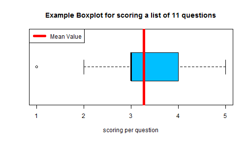

## Content

1. Background for using a Project Evaluation Sheet
2. Calculating the Mean Value
3. Using a Net Promoter Score

--- .class #id 

## Background for using a Project Evaluation Sheet

The Project Evaluation Sheet is a management tool to assess perceived project performance by the customer. These are the questions which get a score from 1 (Unacceptable) to 5 (Excellent).

1. Understanding what brings value to your business
2. Understanding the issues at stake & stating the question
3. Project approach to handle the question
4. Exploratory data analysis
5. Model building
6. Interpretation of results
7. Communication
8. Effort and throughput time
9. Handling change requests and problem reports
10. Quality of order process (proposal, quotation, invoice)
11. Value for Money

--- .class #id

## Calculating the mean value

This is a boxplot for an example questionnaire, showing the spread and the mean value.


```r
projecteval <- as.data.frame(c(3, 4, 3, 5, 3, 2, 3, 4, 1, 5, 3)); names(projecteval) <- "scoring"
boxplot(projecteval, horizontal  = TRUE, col = "deepskyblue", 
        main = "Example Boxplot for scoring a list of 11 questions",
        xlab = "scoring per question")
mu <- mean(projecteval$scoring);lines(c(mu, mu), c(0, 200), col = "red", lwd = 5)
legend("topleft", lty = 1, col = "red", lwd = 5, legend = "Mean Value")
```



--- &radio

## Using a Net Promoter Score

The Net Promoter Score (NPS) methodology is added, as a secondary way to assess customer perception. This with the intention to get an overall picture of the perceived project quality.

Which NPS score do you need so that your customer will recommend you to someone else?

1. 6
2. 7
3. 8
4. _9_
5. _10_

*** .hint

The NPS scoring is very strict. Only customers which are really satisfied will promote you to someone else. An "Ok"-ish performance isn't good enough!

*** .explanation

Only customers which scores a 9 or 10 will sufficiently promote you to someone else. 
They are the ones who'll put their reputation on the line in your favour.


